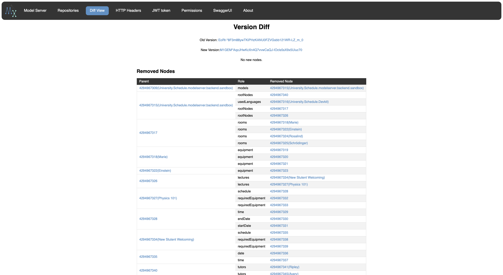

This article gives you an update on what happened in the Modelix project since the [Modelix Platform release 24.1](blog/2024/05/16/modelix-platform-release-24.1/).

Firstly, we have decided not to release any more platform versions. 
There is so much development in between that we don't want to encourage users to use outdated versions of infrequent releases of the platform versions.
When you start using Modelix, get the latest versions of the components and keep them up to date. 
Our components use [semantic versioning](https://semver.org/) and changes are released on a daily basis.

We still want to keep you informed with blog posts like this. The following summarizes the highlights since the last update.


- [Features](#features)
  - [Model-Server: Support for authorization](#model-server-support-for-authorization)
  - [Model-Server: Indices and Caching for ModelQL](#model-server-indices-and-caching-for-modelql)
  - [Model-Server: View for changes between model data versions](#model-server-view-for-changes-between-model-data-versions)
  - [Optimizations for bulk synchronization](#optimizations-for-bulk-synchronization)
- [Improvements](#improvements)
  - [Rework and stabilize API for Vue.js](#rework-and-stabilize-api-for-vuejs)
  - [Refactoring execution of ModelQL queries](#refactoring-execution-of-modelql-queries)
- [Experimental Features](#experimental-features)
  - [Projectional text editors for the browser](#projectional-text-editors-for-the-browser)

# Features

## Model-Server: Support for authorization

You can now [enable authorization on the model-sever](https://docs.modelix.org/modelix/main/core/reference/component-model-server.html#_json_web_tokens_jwt_based_authorization) to give users limited access to model data. 
You can limit a user's access to specific repositories and branches or also specify whether they can only read data, write data or even rewrite the history of a repository.

The authorization requires JWT tokens that specify a user's permissions in a specific claim. 
Such JWT tokens can be created by appropriately configured OAuth providers or by custom services.

## Model-Server: Indices and Caching for ModelQL

To reduce the runtime of complex queries and to reduce resource consumption, [indices and caching were built into ModelQL](https://docs.modelix.org/modelix/main/core/howto/modelql.html#_indicescaching).


The following example shows how to cache the count of nodes that match a complex filter in ModelQL.

```kotlin
val countOfNodes = client.query { rootNode ->
   rootNode.memoize { rootNodeInner ->
       rootNodeInner.descendants(true).filter { it.someComplexFilter() }.count()
   }
}
``` 
Example for caching the count of nodes that match a complex filter in ModelQL

## Model-Server: View for changes between model data versions

The model-server now provides a UI to explore changes between versions of data in a repository. 



## Optimizations for bulk synchronization

The synchronization of data from a model-server to MPS can now be done faster. 
When you know the version you synchronized to MPS the last time, you can now [specify it as a base revision](https://docs.modelix.org/modelix/main/core/reference/component-bulk-model-sync-gradle.html#_serversource_target_configuration). 
In that case, the bulk synchronization utilizes efficient diffing between versions to only synchronize changed nodes.

# Improvements

## Rework and stabilize API for Vue.js

After incorporating user feedback, we declared the API Vue.js as stable and will avoid breaking changes.

## Refactoring execution of ModelQL queries

To achieve better performance in ModelQL queries even without indices and caches, the [ModelQL execution was refactored](https://issues.modelix.org/issue/MODELIX-914/Remove-in-memory-query-cache-and-support-querying-multiple-large-branches-in-parallel).

# Experimental Features

## Projectional text editors for the browser

Modelix is working on rendering projectional text editors in the browser.  
For that an internal Kotlin-based DSL to define such editors was built and [open sourced under the Modelix organization](https://github.com/modelix/modelix.text-editor).

In June, the Modelix team gave a webinar about building modeling tools with Modelix. At the end of the webinar, those new components for web editors were demonstrated. 
You can request access to the recording [on the website of itemis](https://info.itemis.com/en/webinar/empowering-domain-experts/).  
