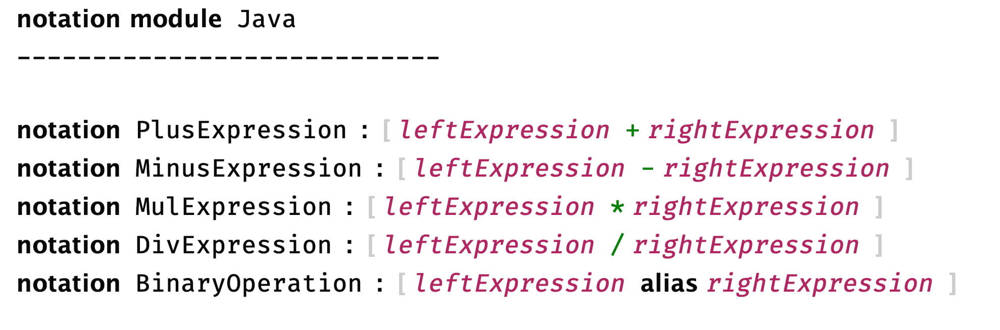

This is the first post in a regular series where we will give an update on modelix development. In this first post we will look at what happened in modelix since the [open source announcement](https://blogs.itemis.com/en/modelix-and-the-future-of-language-engineering) by itemis last year.

## MPS 2020.3

 Modelix is [now based](https://github.com/modelix/modelix/pull/57) on top of  MPS 2020.3 and supports projects using the latest MPS version. You might wonder why 2020.2 was skipped? We encountered problems during the migration to 2020.2 which were supposedly fixed in the code was designated to become MPS 2020.3 and we decided to skip this version.

## Native HTML Editors

While modelix features a "picture based" editor for existing MPS languages from the very beginning, modelix is also working on editor implementations that are native to the web.

One of such editor implementations is the "web aspect" and the "modelix.notation" language. Right now these editor definitions are focused on textual editors that render directly in the browser using HTML. The HTML for the editor is rendered on the server and then send to the client. Updates to the editor are also rendered on the server and the affected HTML is updated on the client side.

The implementation is not feature complete yet but should give you a good impression what's to come in the future.

## Modelix at MPS Talks

At the MPS talk series, an online event organized by itemis and JetBrains, Sascha presented modelix. The presentation includes a live demo of the collaborative features and a detailed explanation on how conflicting edits are handled as well as an overview on the modelix architecture. Check out the recording the [blog post](/blog/2020/12/03/modelix-in-the-mps-talk-series/).

## Project Bindings

After many smaller contributions Federico has made a large [contribution](https://github.com/modelix/modelix/pull/58) improving the interoperability between modelix and MPS.

Project bindings allow you to configure connections to a modelix backend inside  of your MPS project and persist this configuration. While connections to a modelix repository where always possible, they were never persisted as part of the project. The configuration is now stored as a file along with the rest of the MPS project and can be committed as part of your normal version control workflow.

Project bindings are the bases for uses cases where existing models are easily migrated into modelix by an end user.
